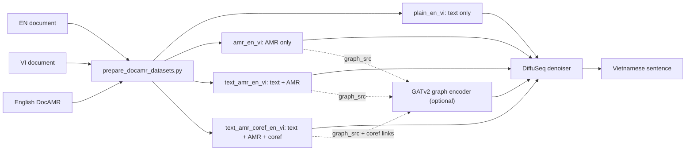
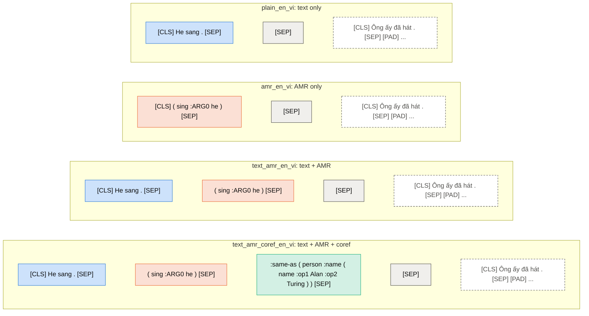
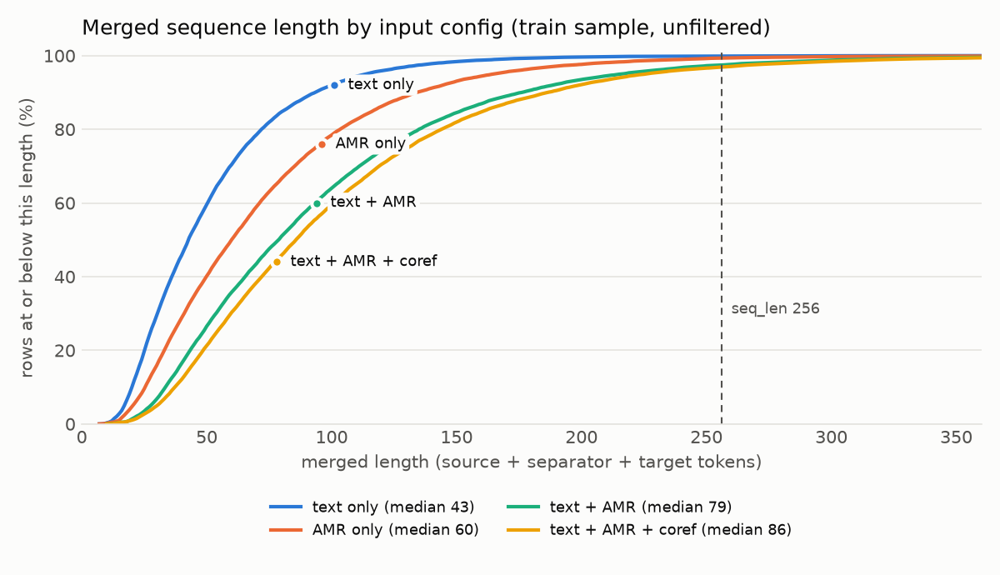
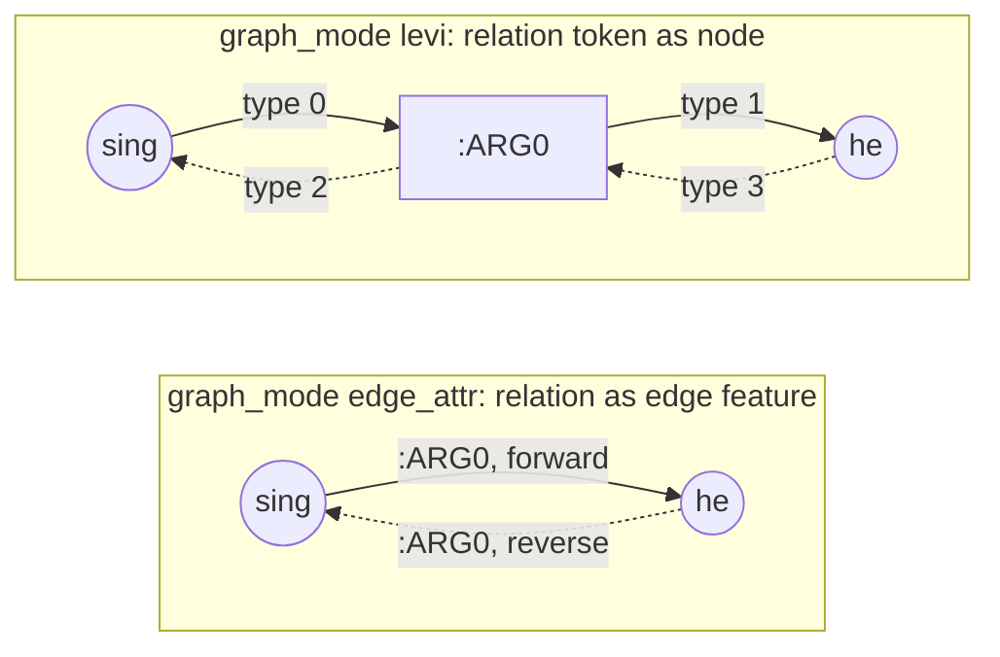
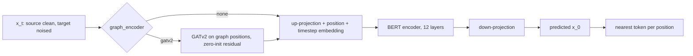
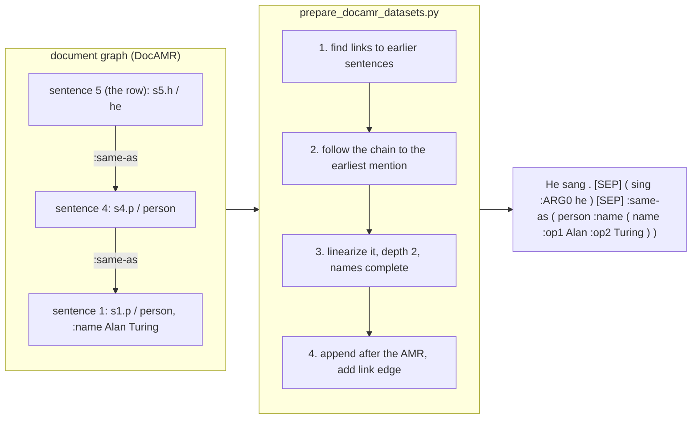
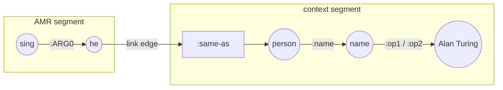
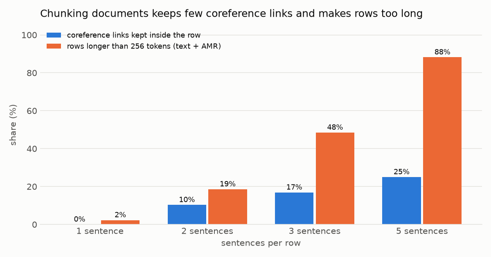
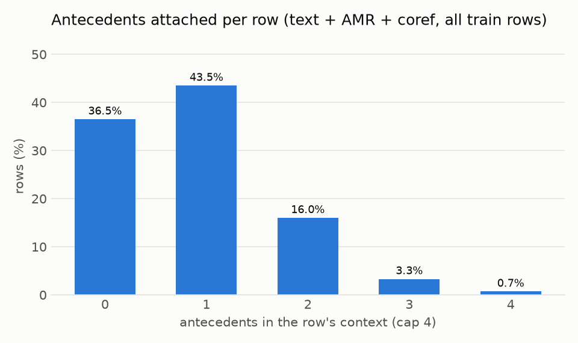
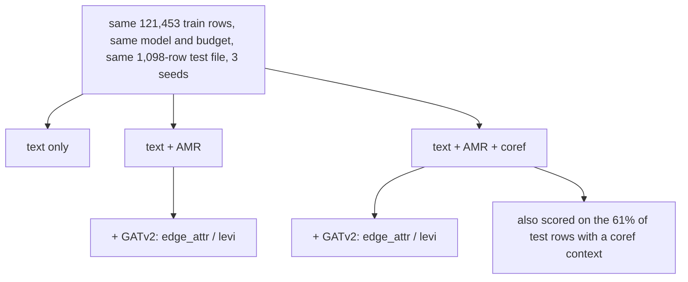

# AMR Input Configurations

- **Type**: architecture
- **Status**: current
- **Last updated**: 2026-10-03
- **Related**: [../data/data-format.md](../data/data-format.md) · [../plans/pipeline-fixes-and-amr-redesign.md](../plans/pipeline-fixes-and-amr-redesign.md) · [`scripts/plot_amr_configs.py`](../../scripts/plot_amr_configs.py)

---

## Purpose

Visual reference for every way the pipeline feeds English AMR to the DiffuSeq translator: what the source
sequence looks like per dataset variant, how the graph module reads it, how the coreference context is
attached, and how long the resulting sequences are. Field-level contract:
[data-format.md](../data/data-format.md).

## Overview

All four configs share the same sentences (built together, 121,453 train rows each), the same target (one
Vietnamese sentence) and the same unfiltered test file (1,098 rows); they differ only in the source.

---

## Details

### 1. Sequence layout per config

Constructed example. Document sentence 1: *"Alan Turing was a scientist."*; the row is sentence 2:
*"He sang."* → *"Ông ấy đã hát."* (the pronoun *ông ấy* fits an older, respected man; the
coreference context tells the model who *he* is).

| Segment | Box style | `input_mask` | Diffusion |
|---|---|---|---|
| English text | blue | 0 (source) | kept clean, re-anchored every step |
| linearized AMR of the sentence | orange | 0 | kept clean |
| coreference context | green | 0 | kept clean |
| separator `[SEP]` | gray | 0 | kept clean |
| Vietnamese target incl. `[PAD]` | dashed | 1 (target) | starts as noise, denoised to the translation |

The `bidirectional` variant adds a direction token after `[CLS]` (`[AMR_TO_TEXT]` rows have the AMR-only
layout; `[TEXT_TO_AMR]` rows translate Vietnamese into AMR) and is kept as an auxiliary-task option.

· · ·

### 2. Length cost of each config

| Config | Median | p95 | Rows > 256 tokens |
|---|---|---|---|
| text only | 43 | 114 | 0.1% |
| AMR only | 60 | 165 | 0.7% |
| text + AMR | 79 | 216 | 2.6% |
| text + AMR + coref | 86 | 226 | 3.1% |

20,000 train sentences, before the length filter. The build drops a train sentence from every config when
any config exceeds 256 tokens (3.0% of sentences), so all configs train on the same rows.

· · ·

### 3. Graph input: `edge_attr` vs `levi`

The AMR part of the source carries `graph_src` entries `[head, dep, label, label_pos]` (token positions).
`--graph_encoder gatv2` turns them into edges in one of two ways:

| Mode | Nodes | Edge types | Relation identity enters through |
|---|---|---|---|
| `edge_attr` | concepts | 2 × (145 relations + unknown) | the edge-feature embedding of the GATv2 attention |
| `levi` | concepts + relation tokens | 4 (head→label, label→dep, reverses) | the relation token's own embedding |

Where the graph module sits in the denoiser:

The GATv2 output is added only on positions that appear in an edge (all in the source); noised target
positions pass through unchanged, and at initialization the model equals the no-graph model.

· · ·

### 4. Coreference context

How an earlier-sentence antecedent becomes part of the row (`find_coref_links` →
`append_coref_context`):

In the row, the link is a graph entry from the mention to the antecedent root through the `:same-as`
token, so GATv2 passes the antecedent's information (name, role, gender-bearing concepts) to *he*:

Why not translate several sentences per row instead:

| Sentences per row | Coreference links kept inside the row | Rows > 256 tokens (text + AMR) |
|---|---|---|
| 1 | 0% | 2.3% |
| 2 | 10% | 18.6% |
| 3 | 17% | 48.5% |
| 5 | 25% | 88.2% |

59% of links point 6+ sentences back, so chunks recover few of them while the Vietnamese output grows past
what the diffusion model handles well. The context approach covers every backward link at +7 tokens median:

| Antecedents in the row | 0 | 1 | 2 | 3 | 4 |
|---|---|---|---|---|---|
| Share of train rows | 36.5% | 43.5% | 16.0% | 3.3% | 0.7% |

· · ·

### 5. Experiment arms

AMR only (`amr_en_vi`) is a diagnostic arm: AMR omits tense, number, articles and word order, so it is
expected to score below text only.

---

## Gotchas

- **Which AMR items are single tokens** (relations, `-9x` frames) and why the rest are not:
  [amr-vocabulary.md](../data/amr-vocabulary.md).
- **Graph positions are tokenizer-bound.** Every `graph_src` position was computed with mBERT +
  `amr_vocab.json`; build and train with the same `--amr_vocab`.
- **Text-only runs cannot see which mention a context entry belongs to** (entries follow mention order);
  only the graph link edge is precise. Pointer tokens are a proposed alternative.
- **Charts are regenerated, not edited:** `CUDA_VISIBLE_DEVICES="" python scripts/plot_amr_configs.py`
  (~7 min, CPU; `--replot` redraws from the cache). The tables in this file are copied from
  `assets/amr_configs_stats.json`.
- **The example in §1 is constructed** for readability; real rows are in `datasets/docAMR/v2_*` (e.g. the
  "we, Earthlings" row in [plan §3b](../plans/pipeline-fixes-and-amr-redesign.md#phase-3b--cross-sentence-coreference-context-built-2026-10-03)).
