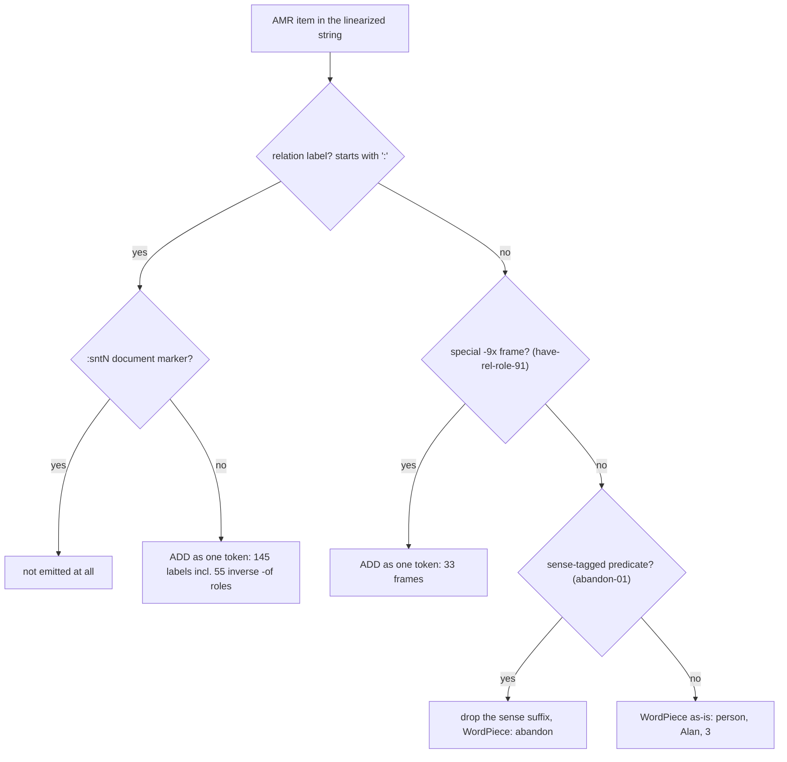

# AMR Vocabulary: What Becomes a Token and Why

- **Type**: data-spec
- **Status**: current
- **Last updated**: 2026-10-03
- **Related**: [data-format.md](data-format.md) · [../architecture/01-amr-input-configs.md](../architecture/01-amr-input-configs.md) · [`basic_utils.py`](../../basic_utils.py) (`amr_added_tokens`, `validate_added_tokens`) · [`scripts/build_amr_vocab.py`](../../scripts/build_amr_vocab.py) · [`scripts/_oneshot/amr_vocab_study.py`](../../scripts/_oneshot/amr_vocab_study.py)

---

## Purpose

The DiffuSeq student tokenizes the linearized AMR with mBERT WordPiece. Some AMR items are added to the
tokenizer as new single tokens; everything else is split into existing WordPiece units. This file records
which items are added, which are not, and the measured reason for each decision. All numbers come from
`scripts/_oneshot/amr_vocab_study.py` on the aligned train split (125,189 sentences; 20,000-sentence samples
where stated).

## Overview

Added in total: 145 relation labels + 33 `-9x` frames + 2 direction tokens = 180 entries on top of mBERT's
119,547 (119,727 total; `amr_vocab.json` has 178 + the two direction tokens added by `myTokenizer`).

---

## Details

### 1. Terminology: relations, roles, frames

| Term | AMR meaning | Examples | Token treatment |
|---|---|---|---|
| core role | numbered argument of a predicate | `:ARG0` (agent), `:ARG1` (patient), `:ARG2` … `:ARG5` | added |
| non-core role | general semantic relation | `:time`, `:location`, `:mod`, `:manner`, `:polarity`, `:name` | added |
| inverse role | the same relation read from the child (`-of` reverses direction) | `:ARG0-of`, `:ARG1-of`, `:part-of`, `:poss-of` | added |
| operand | ordered members of `and`, `name`, … | `:op1`, `:op2`, … | added |
| coreference link | DocAMR cross-sentence identity | `:same-as` | added |
| document marker | sentence slot of the document root | `:snt1`, `:snt2`, … | never emitted |
| special frame | a relation reified as a concept node | `have-rel-role-91`, `have-org-role-91`, `have-degree-91`, `include-91` | added |
| predicate frame | PropBank sense of a verb / adjective | `abandon-01`, `sing-01`, `look-02` | sense dropped → WordPiece |
| other concept | entity, attribute, constant | `person`, `name`, `Alan`, `3`, `-` | WordPiece |

"Relation" and "role" name the same thing in this project: an edge label. `have-…-91` items look like
roles but are concepts (nodes): `(h / have-rel-role-91 :ARG0 (p / person) :ARG2 (f / father))` states
"p is a father" as a node with its own arguments.

· · ·

### 2. Inventory (train split)

| Category | Distinct | Occurrences | Rare (seen < 5×) |
|---|---|---|---|
| relation labels | 145 (55 inverse) | 1,535,199 (inverse 168,603) | — |
| special `-9x` frames | 33 | 39,342 | 4 |
| sense-tagged predicates | 4,981 | 491,633 | 1,456 (2,933 seen < 20×) |
| all distinct concept strings (incl. names, numbers) | 27,584 | — | — |

Most frequent relations: `:ARG1` 311,200 · `:ARG0` 212,194 · `:mod` 136,895 · `:ARG2` 115,095 · `:op1`
112,674 · `:ARG1-of` 101,144. Most frequent `-9x` frames: `have-degree-91` 12,353 · `include-91` 5,688 ·
`have-rel-role-91` 5,485.

· · ·

### 3. Why relation labels ARE added

1. **Cost when split.** Without an added token a relation averages 3.48 WordPiece units:
   `:ARG0` → `: AR ##G ##0`, `:ARG1-of` → `: AR ##G ##1 - of`. With 1.5M occurrences this is the largest
   avoidable length cost in the AMR segment.
2. **Meaning sits in the last piece.** Split, `:ARG0` and `:ARG1` share three of four pieces and differ only
   in `##0` / `##1`; the agent/patient distinction (the main information AMR adds over the words) would ride
   on one subword. One token gives each relation its own embedding.
3. **Pipeline needs one position per relation.** The Levi graph mode uses the relation token as a node,
   `rel_mask` marks relation positions, and link edges point at the `:same-as` token; a single token makes
   each of these one position.
4. **Safe.** Every label starts with `:` and never occurs inside ordinary text: adding them changes the
   tokenization of 0.00% of plain EN / VI sentences.
5. **Closed and covered.** 145 labels from train cover 100% of relation occurrences in the test split.

· · ·

### 4. Why the 33 `-9x` frames ARE added

- **Long when split:** 5.44 pieces on average (`have-rel-role-91` → `have - re ##l - role - 91`).
- **Frequent and closed:** 39,342 occurrences, only 4 frames seen fewer than 5 times.
- **Not English words:** they are AMR constructs, so WordPiece sharing with the English text brings no
  benefit (unlike ordinary predicates, §5).
- **Safe:** hyphenated with a `-9x` suffix; 0.00% of plain sentences change.

· · ·

### 5. Why the 4,981 sense-tagged predicates are NOT added

Adding them is safe for plain text (0.00% of sentences change, the `-01` suffix never occurs in normal
text), so the decision rests on three measured costs:

1. **Rare rows cannot be learned.** 1,456 predicates occur fewer than 5 times and 2,933 fewer than 20 times
   in the whole train split. Each added token is a new randomly initialized embedding row, trained only from
   its own occurrences.
2. **They break the link to the English sentence.** In the text + AMR source, a concept that shares its
   token with the English word lets the model align the two segments (`sing` has id 21253 in both). Share of
   AMR concept tokens whose id also occurs in the row's English sentence:
   - shipped setup (senses dropped, predicates as WordPiece): **53.3%**;
   - all predicates added as tokens, senses kept: **38.6%**.
3. **Dropping the sense is cheaper than keeping it.** Split with sense: 3.26 pieces (`abandon-01` →
   `abandon - 01`); sense dropped: 1.26 pieces (`abandon`). Sense numbers distinguish PropBank rolesets
   (`run-01` move fast vs `run-02` operate); for translation the English sentence in the same source already
   disambiguates the verb.

Coverage is not a reason either way: only 0.3% of predicate types (0.07% of occurrences) in test are unseen
in train.

· · ·

### 6. Why other concepts are NEVER added

Concepts with the sense dropped are ordinary words (`person`, `sing`, `inform`, `age`). HF added tokens are
matched as raw substrings before WordPiece runs, so a bare word splits every longer word that contains it:

| Candidate added vocabulary | Added tokens | Plain EN sentences changed | Plain VI sentences changed |
|---|---|---|---|
| relations + `-9x` frames (shipped) | 178 | 0.00% | 0.00% |
| + all sense-tagged predicates | 5,159 | 0.00% | 0.00% |
| + all concepts, senses dropped (bare words) | 25,844 | **95.24%** | **99.82%** |

Example with the earlier `doc_amrs_token_simple.json` (review bug B1): `rachel` → `r ache l`,
`information` → `inform ati ##on`. This is why `validate_added_tokens` accepts only items that start with
`:` or are hyphenated `-9x` frames, and raises on anything else.

· · ·

### 7. Implementation

| Piece | Role |
|---|---|
| `scripts/build_amr_vocab.py` | collects relation labels (minus `:sntN`) and `-9x` frames from the train split → `amr_vocab.json` |
| `basic_utils.amr_added_tokens("relations")` | loads `relations + frames` in file order |
| `basic_utils.validate_added_tokens` | rejects any token that could occur inside ordinary text |
| `basic_utils.check_vietnamese_round_trip` | rejects tokenizers that cannot reproduce Vietnamese (Multilingual Tokenizer Rule) |
| `diffuseq/amr_linearize.py` (`drop_sense=True`) | `abandon-01` → `abandon`; keeps `-9x` |
| `tests/test_tokenizer.py` | plain-text tokenization identical to base mBERT; relation / frame / direction tokens are single ids |

The teacher (`teacher/`) does not read AMR and has its own joint BPE; this file concerns the DiffuSeq
student only.

---

## Gotchas

- **Rebuilding `amr_vocab.json` changes token ids** of every added item and the relation ids of
  `--graph_mode edge_attr`; keep it fixed for the lifetime of a comparison and rebuild datasets with it.
- **Unseen relations in new data** fall back to WordPiece (`:` + pieces) and to relation id 0 (unknown) in the
  graph; the train-derived list covers 100% of test relation occurrences.
- **Sense dropping is a design choice, not a measurement of translation quality.** An ablation with senses
  kept (as WordPiece, no added tokens) is cheap: `--drop_sense false` in `prepare_docamr_datasets.py`.
