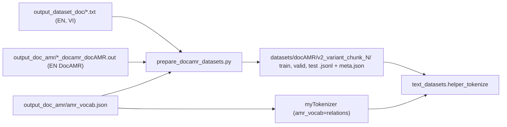

# Dataset Format

- **Type**: data-spec
- **Status**: current
- **Last updated**: 2026-10-03
- **Related**: [../plans/pipeline-fixes-and-amr-redesign.md](../plans/pipeline-fixes-and-amr-redesign.md) · [`prepare_docamr_datasets.py`](../../prepare_docamr_datasets.py) · [`diffuseq/text_datasets.py`](../../diffuseq/text_datasets.py)

---

## Purpose

Contract between the dataset builder (`prepare_docamr_datasets.py`) and the loader
(`diffuseq/text_datasets.py`). Read before writing code that produces or consumes a dataset folder.

## Overview



## Details

### Source documents

| Path | Content |
|---|---|
| `datasets/docAMR/output_dataset_doc/<split>.en/doc-N.txt` | EN sentences, one per line |
| `datasets/docAMR/output_dataset_doc/<split>.vi/doc-N.txt` | VI sentences, line-aligned with EN |
| `datasets/docAMR/output_doc_amr/<split>.en/doc-N_docamr_docAMR.out` | DocAMR of the EN document; `:snt1 … :sntN` = EN lines |
| `datasets/docAMR/output_doc_amr/<split>.vi/doc-N.txt` | byte-identical copy of the VI document |

Split folders: `train_en-vi`, `dev2010.en-vi` (valid), `tst2015.en-vi` (test). A document is used only when
EN lines = VI lines = `:snt` graphs (all 1,144 documents pass, 2026-10-03).

### Dataset folder

`datasets/docAMR/<prefix>_<variant>_chunk_<N>/` with `train.jsonl`, `valid.jsonl`, `test.jsonl`,
`meta.json` (build arguments, counts, date). Folders of logged runs are never overwritten; a rebuild uses a
new prefix.

| Variant | `src` | `trg` | Extra fields |
|---|---|---|---|
| `plain_en_vi` | EN text | VI text | — |
| `plain_vi_en` | VI text | EN text | — |
| `amr_en_vi` | linearized EN AMR | VI text | `graph_src` |
| `vi_amr` | VI text | linearized EN AMR | — |
| `text_amr_en_vi` | `EN text [SEP] linearized EN AMR` | VI text | `graph_src` |
| `bidirectional` | `vi_amr` rows + `amr_en_vi` rows | | `direction`; `graph_src` on `AMR_TO_TEXT` rows |

Example row (`v2_text_amr_en_vi_chunk_1`, constructed):

```json
{"src": "I sing . [SEP] ( sing :ARG0 i )", "trg": "Tôi hát .", "graph_src": [[6, 8, ":ARG0", 7]]}
```

### Distilled variants (`<dataset>_kd-<tag>/`)

Written by `scripts/build_kd_dataset.py`: `train.jsonl` with `trg` replaced by the teacher translation of the
row's EN source (same text in every aligned variant; other fields unchanged), `valid.jsonl` / `test.jsonl`
copied unchanged (human references), `meta.json` = base meta + a `kd` block (teacher, tag, beams, cache path,
kept / dropped rows, optional `teacher_on_test`). Translations are cached in
`<source dataset>/kd-<tag>_cache.jsonl` (`{"src", "hyp"}` per line).

### `graph_src`

Entries `[head_pos, dep_pos, label, label_pos]`:

- positions index the tokenized `src` string with special tokens (`[CLS]` = 0), before any direction token;
- `head_pos` / `dep_pos` = first subword of the parent / child concept; `label_pos` = the relation token;
- re-entrant variables point to the defining occurrence of the concept;
- the loader shifts positions by +1 when a direction token is prepended and drops entries outside the
  trimmed source (`text_datasets.shift_source_graph`).

A target-side graph is never stored or read (it would expose the answer's structure at decoding time).

### Linearization (`diffuseq/amr_linearize.py`)

| Rule | Example |
|---|---|
| node with children in brackets, leaf bare | `(s / sing-01 :ARG0 (i / i))` → `( sing :ARG0 i )` |
| relation labels verbatim, digits kept | `:ARG0`, `:ARG1-of`, `:op2` |
| sense suffix dropped (`--drop_sense true`), `-9x` frames kept | `grow-01` → `grow`; `have-org-role-91` kept |
| constants unquoted | `"U.S."` → `U.S.` |
| reference to a variable outside the chunk dropped with its relation | `:ARG0 s1.i` in sentence 2 of a chunk-1 row |

### `amr_vocab.json`

Built by `scripts/build_amr_vocab.py` from the train split: `relations` (145 labels, 55 inverse `-of`
roles; `:sntN` excluded), `frames` (33 `-9x` frames), counts, source note. `myTokenizer` adds `relations +
frames` in this order, then `[TEXT_TO_AMR]`, `[AMR_TO_TEXT]`. Every added token passes
`validate_added_tokens` (starts with `:` or is a hyphenated `-9x` frame), so plain EN / VI text tokenizes
exactly as with base mBERT (tested).

### Length filter

Train only: a chunk is dropped from every variant of one build when any of its rows has
`len(src ids) + 1 + len(trg ids) > --max_seq_len` (the merged DiffuSeq length). Valid and test are never
filtered. `--seq_len` of training must equal `--max_seq_len` of the build (`meta.json`).

## Gotchas

- Graph positions depend on the tokenizer. Build and train with the same `amr_vocab`; decoding reloads the
  run's saved tokenizer.
- `plain_text_*_chunk_1` folders (built before 2026-10-03) come from the older prep script: metadata lines
  included, test filtered to 1,061 rows. Do not compare them with `v2_*` results.
- The relation vocabulary for graph edge types is read from `paths.AMR_VOCAB_FILE`; rebuilding it after
  training a graph run changes relation ids. Keep the file fixed for the lifetime of a comparison.
