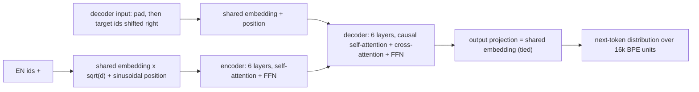

# Autoregressive Teacher for Knowledge Distillation

- **Type**: plan
- **Status**: current — implementation done 2026-10-03 (CPU-tested); teacher training run pending (GPU)
- **Last updated**: 2026-10-03
- **Related**: [pipeline-fixes-and-amr-redesign.md](pipeline-fixes-and-amr-redesign.md) (Phase 2) · [PENDING.md](PENDING.md) · [../data/data-format.md](../data/data-format.md) · [`scripts/train_teacher.py`](../../scripts/train_teacher.py) · [`scripts/build_kd_dataset.py`](../../scripts/build_kd_dataset.py)

---

## 1. Status / gating

| Step | State |
|---|---|
| Teacher choice | option B (decided 2026-10-03): an autoregressive Transformer trained on the v2 train split only — no test leakage by construction |
| Code + tests (`teacher/`, `scripts/train_teacher.py`, `tests/test_teacher.py`) | done 2026-10-03, CPU |
| Teacher training run | open — GPU, user approval (GPU Sharing Rule) |
| Distilled datasets (`build_kd_dataset.py --teacher teacher_models/<name>/best`) | open — after the teacher run |
| Gate to use the teacher | valid BLEU (beam 5) clearly above the diffusion baseline and in the range reported for IWSLT'15 en–vi Transformers (high 20s to low 30s); otherwise tune before distilling |

---

## 2. Why a teacher, and why this one

- **What KD does:** the teacher translates every train source; its outputs replace the human Vietnamese
  references as training targets of the diffusion student. A single teacher produces one consistent style
  per input, which removes much of the multimodality that makes non-autoregressive models repeat tokens
  (24.8% adjacent duplicates in the 2026-05 en→vi baseline).
- **Why train it here:** a public en→vi model may have been trained on corpora that include the TED talks of
  tst2015; its outputs would leak test translations into training. A teacher trained on the 121,453 v2 train
  pairs has seen no valid / test sentence.
- **What stays human:** valid and test references are never distilled; every reported score is against
  human references.

---

## 3. Pipeline

```mermaid
flowchart LR
  D["v2_plain_en_vi_chunk_1 train / valid / test"] --> T1["1. train joint EN+VI BPE tokenizer (train split only)"]
  T1 --> T2["2. encode + length-bucketed batches"]
  T2 --> T3["3. train Transformer encoder-decoder (label-smoothed CE, inverse-sqrt LR)"]
  T3 --> T4["4. each epoch: valid loss + greedy valid BLEU, keep best"]
  T4 --> T5["5. final: beam-5 BLEU on valid and test"]
  T5 --> B["teacher_models/name/best (Hugging Face format)"]
  B --> K["build_kd_dataset.py: translate train sources"]
  K --> KD["*_kd-name datasets (all 4 input configs)"]
  KD --> S["DiffuSeq student training"]
```



<p align="center">· · ·</p>

### 3.1 Components

| Component | What it does | Why | Example |
|---|---|---|---|
| Joint BPE tokenizer (`teacher/tokenizer.py`) | learns 16,000 subword units from EN and VI train text together; NFC normalization; spaces kept as `▁` so decoding restores the exact string; appends `</s>` | small shared vocabulary (vs 119,727 in mBERT) → fast softmax, shared embeddings for names and numbers in both languages | `Tôi hát .` → `▁Tôi ▁hát ▁.` + `</s>` |
| Length buckets (`teacher/data.py`, `TokenBucketBatcher`) | sorts pairs by length, cuts batches so `rows × longest row ≤ --max_tokens`, shuffles batch order per epoch | constant memory per step, little padding | 4,096-token budget: 120 rows of 34 tokens, or 16 rows of 256 |
| Collate (`teacher/data.py`) | pads sources and targets; target pads become `-100` | `-100` positions are ignored by the loss | see §5 |
| Marian encoder-decoder (`teacher/model.py`) | Transformer with sinusoidal positions and tied input/output embeddings, built from config (random init) | standard architecture; saved with `save_pretrained`, so `AutoModelForSeq2SeqLM` loads it in `build_kd_dataset.py` unchanged | — |
| Label-smoothed cross-entropy | loss with 0.1 of the probability mass spread over the vocabulary | standard regularizer for MT; better-calibrated beam search | — |
| Inverse-sqrt LR schedule | linear warmup over 4,000 updates to 5e-4, then `∝ 1/sqrt(step)` | standard Transformer schedule (fairseq IWSLT recipe) | step 1,000 → 1.25e-4; step 16,000 → 2.5e-4 |
| Model selection | greedy BLEU on valid after every epoch; best checkpoint kept; stop after `--patience` epochs without gain | BLEU, not loss, is what distillation quality depends on | — |
| Resume state (`last.pt`) | model, optimizer, schedule step, epoch, RNG states | multi-hour run survives interruption | — |

<p align="center">· · ·</p>

### 3.2 Model architecture



| Hyperparameter | `iwslt` preset | Note |
|---|---|---|
| `d_model` / FFN | 512 / 1,024 | fairseq `transformer_iwslt_de_en` |
| layers enc / dec | 6 / 6 | |
| attention heads | 4 | |
| dropout / attention dropout / activation dropout | 0.3 / 0.1 / 0.1 | heavy dropout fits the 121k-pair corpus |
| activation | ReLU | |
| vocabulary | 16,000 joint BPE | encoder, decoder and output share one matrix |
| max positions | 512 (rows ≤ 256 tokens) | |
| parameters | 40.3M (16k vocabulary, tied embedding counted once) | printed by `train_teacher.py` |

A `tiny` preset (d_model 64, 1+1 layers) exists for CPU tests only.

<p align="center">· · ·</p>

### 3.3 Language coverage: multilingual tokenizers only

Vietnamese tones and diacritics carry meaning, so every tokenizer that touches Vietnamese must reproduce
it exactly. English-only BERT fits only English-English tasks:

| Tokenizer | `Tôi muốn cho các bạn biết …` becomes | Usable for EN→VI |
|---|---|---|
| `bert-base-uncased` (English) | `to ##i mu ##on cho ca ##c ban bi ##et …` (lowercased, accents stripped) | no |
| `bert-base-multilingual-cased` (mBERT) | `T ##ôi muốn cho các bạn biết …` (exact) | yes — the DiffuSeq student |
| teacher joint BPE (this plan) | `▁Tôi ▁muốn ▁cho ▁các ▁bạn ▁biết …` (exact) | yes — the teacher |

- **Student:** DiffuSeq uses mBERT's cased tokenizer and config (`config_name
  bert-base-multilingual-cased`); its denoiser weights are random unless `--use_plm_init bert`
  (`hidden_dim 768`) loads mBERT's pretrained encoder.
- **Teacher:** no BERT. Its BPE is learned from the English and Vietnamese train text together, so it is
  multilingual by construction, with 16k entries instead of mBERT's 119,727 (faster softmax, smaller model).
- **Guard:** `basic_utils.check_vietnamese_round_trip` runs inside `myTokenizer` and raises for any
  tokenizer that cannot reproduce the Vietnamese probe sentence (tested with `bert-base-uncased`, mBERT and
  the teacher BPE).
- **Alternative, not planned:** an mBERT-initialized teacher (BERT2BERT warm start, encoder and decoder from
  mBERT, ~380M parameters with the 119k vocabulary). Pretraining helps low-resource pairs, but at 121k pairs a
  from-scratch Transformer is the standard IWSLT teacher, and the larger model would not fit beside the other
  repository's GPU job. Revisit only if the from-scratch teacher misses the gate in §1.

---

## 4. Training and evaluation settings

| Setting | Value |
|---|---|
| data | `v2_plain_en_vi_chunk_1`: train 121,453 / valid 833 / test 1,098 |
| batch | `--max_tokens 4096` per step (source + target tokens of the longest row × rows), `--update_freq 1` |
| optimizer | AdamW, betas (0.9, 0.98), eps 1e-8, weight decay 1e-4, grad clip 1.0 |
| LR | peak 5e-4, warmup 4,000 updates, inverse sqrt |
| loss | cross-entropy, label smoothing 0.1, `-100` ignored |
| precision | bf16 autocast on GPU (Ampere supports bf16; no loss scaling needed); fp32 on CPU |
| epochs | up to 60, early stop after 8 epochs without valid-BLEU gain |
| per-epoch eval | valid loss + greedy valid BLEU (sacreBLEU, 13a) |
| final eval | best checkpoint, beam 5, length penalty 1.0: valid and test BLEU / chrF → `final_metrics.json` |
| seed | 1 (data order, dropout, init) |

Expected cost on the RTX 3060 Ti (estimate, verify on the first epoch): ~6M tokens per epoch, a few
minutes per epoch, a few hours for the full run; peak memory ~3 GB at 4,096 tokens in bf16 (fits beside
the other repository's ~3 GB).

---

## 5. Index and shape walkthrough (one batch)

Pairs: `("I sing .", "Tôi hát .")`, `("Thank you .", "Cảm ơn các bạn .")`; ids shown as tokens.

| Step | Tensor | Content | Shape |
|---|---|---|---|
| 1 | source ids (tokenizer, `</s>` appended) | `▁I ▁sing ▁. </s>` / `▁Thank ▁you ▁. </s>` | lengths 4 / 4 |
| 2 | target ids | `▁Tôi ▁hát ▁. </s>` / `▁Cảm ▁ơn ▁các ▁bạn ▁. </s>` | lengths 4 / 6 |
| 3 | `input_ids` (pad id 0) + `attention_mask` | sources padded to the longest source | `[2, 4]` |
| 4 | `labels` = targets padded with `-100` | row 1: `▁Tôi ▁hát ▁. </s> -100 -100` | `[2, 6]` |
| 5 | `decoder_input_ids` = `shift_tokens_right(labels)` inside the model | row 1: `<pad> ▁Tôi ▁hát ▁. </s> <pad>` (start token = pad; `-100` → pad) | `[2, 6]` |
| 6 | logits | one distribution per target position | `[2, 6, 16000]` |
| 7 | loss | label-smoothed CE over the 10 positions whose label ≠ `-100` | scalar |

Invariants (asserted in tests): every label row ends with `</s>` before its padding; `labels == -100`
exactly where the target is padding; position *t* of `decoder_input_ids` holds label *t − 1*; the batcher
yields every train index exactly once per epoch and never exceeds the token budget unless a single row
alone does.

---

## 6. What gets built

| File | Content |
|---|---|
| `teacher/tokenizer.py` | `train_tokenizer`, `load_tokenizer`, special ids `<pad>`=0 `<unk>`=1 `<s>`=2 `</s>`=3 |
| `teacher/data.py` | `read_pairs`, `encode_pairs`, `TokenBucketBatcher`, `collate` |
| `teacher/model.py` | `build_model(preset, tokenizer, dropout)`, presets `iwslt`, `tiny` |
| `teacher/train_loop.py` | `inverse_sqrt_lr`, `label_smoothed_loss`, `translate`, `bleu`, `train` (epochs, eval, best / last checkpoints, resume, final eval) |
| `scripts/train_teacher.py` | CLI; default device CPU; logs to `logs/train_teacher_<time>.log` and `<out>/metrics.jsonl` |
| `tests/test_teacher.py` | tokenizer round trip and ids; batcher coverage / budget / determinism; collate and label shift (§5); LR values; loss vs manual; tied embeddings; tiny end-to-end train + reload + `build_kd_dataset.hf_translator`; resume (12 tests) |
| `paths.TEACHER_DIR` | `teacher_models/` (git-ignored) |

Output folder `teacher_models/<name>/`:

<pre style="font-size:1rem;line-height:1.5">
teacher_models/&lt;name&gt;/
├── tokenizer/            joint BPE (also copied into best/)
├── best/                 Hugging Face model + tokenizer of the best valid-BLEU epoch → --teacher for build_kd_dataset.py
├── last.pt               resume state (model, optimizer, step, epoch, RNG)
├── metrics.jsonl         one line per epoch: train loss, valid loss, valid BLEU, LR, tokens/s
├── final_metrics.json    beam-5 BLEU / chrF on valid and test for best/
└── args.json             command-line arguments
</pre>

---

## 7. Run commands (GPU steps need approval)

```bash
# CPU smoke test (seconds): tiny preset, 20 steps
CUDA_VISIBLE_DEVICES="" python scripts/train_teacher.py --name smoke --preset tiny --max_steps 20 --max_train_rows 2000

# full teacher (GPU, detached as a systemd unit per the Long-Running Job Rule)
python scripts/train_teacher.py --name iwslt-bpe16k --preset iwslt --device cuda --bf16

# distill all four input configs with it
python scripts/build_kd_dataset.py --teacher teacher_models/iwslt-bpe16k/best --tag iwslt16k \
  --src_dataset v2_plain_en_vi_chunk_1 \
  --companions v2_amr_en_vi_chunk_1,v2_text_amr_en_vi_chunk_1,v2_text_amr_coref_en_vi_chunk_1 \
  --device cuda --batch_size 64 --num_beams 5 --check_test
```

`--check_test` then reports the teacher's test BLEU a second time (it must match `final_metrics.json`; the
exact-match rate should be near 0).

---

## 8. Risks

| Risk | Mitigation |
|---|---|
| Teacher too weak (BLEU far below the 28–32 range) | tune before distilling: dropout, warmup, `--max_tokens` × `--update_freq`, vocabulary 8k / 16k |
| Distilled targets too long for `seq_len 256` | `build_kd_dataset.py` re-applies the joint length filter and records dropped rows |
| GPU contention with the other repository | 4,096-token batches at bf16 ≈ 3 GB; `--max_tokens` lower if needed; never preempt other jobs |
| Run interrupted | `--resume` from `last.pt` |

## 9. Rollback

New code lives in `teacher/` and `scripts/train_teacher.py` only; nothing in the DiffuSeq path imports it.
Removing the folder and `teacher_models/` restores the previous state.
